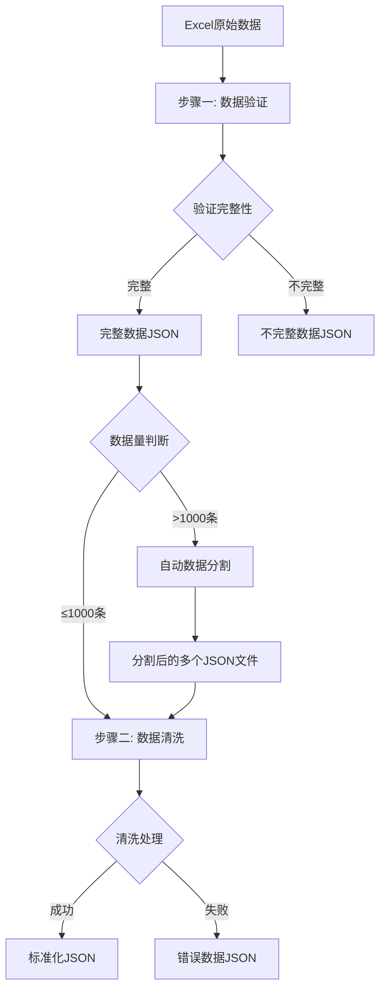

# ProductQuotation - 产品报价数据清洗系统

## 项目概述

ProductQuotation是一个专门用于处理电商平台（主要是1688）商品数据的自动化清洗和标准化系统。该系统能够将爬取的原始商品数据进行验证、清洗和格式转换，最终输出结构化的JSON格式数据，为后续的数据分析和处理提供标准化的数据源。

### 核心功能
- **数据完整性验证**：自动检测关键字段的缺失情况
- **智能数据清洗**：将复杂的列表格式数据转换为结构化JSON
- **字段标准化处理**：针对不同字段类型实施专门的处理逻辑
- **异常数据分离**：自动分离完整和不完整的数据集
- **批量数据处理**：支持大批量商品数据的自动化处理
- **通用日志系统**：提供统一的日志记录和管理功能

## 技术架构

### 系统架构图
```
┌─────────────────┐    ┌──────────────────┐    ┌─────────────────┐
│   原始Excel数据  │───▶│   数据验证模块    │───▶│  数据分离处理    │
└─────────────────┘    └──────────────────┘    └─────────────────┘
                                                         │
                       ┌─────────────────┐              ▼
                       │  不完整数据集    │◀─────┌──────────────┐
                       │ (需要重爬/补充)  │      │   数据分类    │
                       └─────────────────┘      └──────────────┘
                                                         │
                       ┌─────────────────┐              ▼
                       │   完整数据集    │◀─────┌──────────────┐
                       └─────────────────┘      │   数据清洗    │
                                │               └──────────────┘
                                ▼
┌─────────────────┐    ┌──────────────────┐    ┌─────────────────┐
│  标准化JSON输出  │◀───│   数据转换模块    │◀───│  字段处理器集合  │
└─────────────────┘    └──────────────────┘    └─────────────────┘
```

### 数据处理流程
```
输入数据 → 字段验证 → 完整性检查 → 数据分离 → 格式转换 → 字段清洗 → JSON输出
    │         │         │         │         │         │         │
    ▼         ▼         ▼         ▼         ▼         ▼         ▼
 Excel文件   None检查  缺失统计   双路输出   列表解析  键值提取  结构化数据
```

## 项目结构

```
ProductQuotation/
├── src/                           # 源代码目录
│   ├── __init__.py               # 包初始化文件 (v0.1.0)
│   └── data_validator.py         # 数据验证模块 (已实现)
├── utils/                        # 工具函数集合目录 (已实现)
│   ├── __init__.py              # 工具包初始化文件
│   ├── logger_utils.py          # 通用日志工具模块 (已实现)
│   ├── validation_utils.py      # 数据验证工具函数 (已实现)
│   ├── data_utils.py            # 数据处理工具函数 (已实现)
│   └── data_splitter_utils.py   # 数据分割工具函数 (已实现)
├── config/                       # 配置文件目录
│   ├── __init__.py              # 配置包初始化文件
│   └── config.py                # 主配置文件 (已实现)
├── data/                         # 数据目录
│   ├── input/                   # 输入数据目录
│   ├── output/                  # 输出结果目录
│   │   ├── complete/           # 完整数据输出
│   │   ├── incomplete/         # 不完整数据输出
│   │   ├── split_data/         # 分割数据输出 (自动生成)
│   │   └── logs/              # 处理日志
│   └── temp/                   # 临时文件目录
├── tests/                       # 测试文件目录
│   ├── __init__.py             # 测试包初始化文件
│   ├── test_validator.py       # 验证模块测试
│   ├── test_cleaner.py        # 清洗模块测试
│   ├── test_processors.py     # 处理器测试
│   ├── test_file_manager.py   # 文件管理模块测试
│   ├── test_utils/            # 工具函数测试目录
│   │   └── __init__.py        # 工具测试包初始化
│   │   # 后续根据需要添加具体工具函数测试文件
│   └── test_integration.py    # 集成测试
├── requirements.txt             # 依赖包列表 (已配置)
├── step1_data_validator.py      # 步骤一数据清洗的使用示例文件 (已实现)
├── run_tests.py                # 测试运行脚本
├── README.md                   # 项目文档
└── 数据清洗流程.md              # 业务流程文档
```

## 核心模块设计

### 1. 数据验证模块 (data_validator.py) ✅ 已实现
**职责**：检查数据完整性，识别缺失字段

**主要类和方法**：
```python
class DataValidator:
    def __init__(self, required_fields: Optional[List[str]] = None):
        """初始化数据验证器，设置必需字段和日志记录器"""
        
    def validate_required_fields(self, data: List[Dict[str, Any]]) -> Dict[str, Any]:
        """验证数据中的必需字段，返回验证结果统计"""
        
    def separate_data(self, data: List[Dict[str, Any]]) -> Tuple[List[Dict[str, Any]], List[Dict[str, Any]]]:
        """分离完整和不完整的数据"""
        
    def save_validation_results(self, output_dir: str = "data/output") -> Dict[str, str]:
        """保存验证结果到JSON文件"""
        
    def get_validation_summary(self) -> str:
        """获取验证结果摘要报告"""
```

**验证结果存储**：
```python
validation_results = {
    "total_count": 0,        # 总数据条数
    "complete_count": 0,     # 完整数据条数
    "incomplete_count": 0,   # 不完整数据条数
    "complete_data": [],     # 完整数据列表
    "incomplete_data": [],   # 不完整数据列表
    "missing_fields_stats": {} # 缺失字段统计
}
```

### 2. 数据清洗模块 (src/data_cleaner.py) ✅ 已实现

**职责**：将完整的原始数据转换为标准化JSON格式

**主要类和方法**：
```python
class DataCleaner:
    def __init__(self):
        """初始化数据清洗器，设置日志记录器和结果存储"""
        
    def clean_product_data(self, data: List[Dict[str, Any]]) -> Dict[str, Any]:
        """清洗产品数据，返回清洗结果统计"""
        
    def _clean_single_item(self, item: Dict[str, Any], index: int) -> Optional[Dict[str, Any]]:
        """清洗单个数据项，处理所有字段"""
```

**清洗结果存储**：
```python
cleaning_results = {
    "total_count": 0,      # 总数据条数
    "success_count": 0,    # 成功清洗条数
    "error_count": 0,      # 清洗失败条数
    "cleaned_data": [],    # 清洗成功的数据
    "error_data": [],      # 清洗失败的数据
    "cleaning_report": {}  # 清洗报告
}
```

**字段清洗器**：
```python
field_cleaners = {
    "商品标题": self._clean_title,
    "时间": self._clean_time_data,
    "价格": self._clean_price_data,
    "销售": self._clean_sales_data,
    "商品详情": self._clean_product_details,
    "包装重量": self._clean_package_weight,
    "主产品图片": self._clean_image_urls,
    "商品详情图片": self._clean_image_urls,
    "sku商品详情图片和信息": self._clean_sku_data,
    "产品网址": self._clean_product_url,
    "公司基本信息": self._clean_company_info,
    "公司详情信息": self._clean_company_details
}
```

### 3. 工具函数模块 (utils/) ✅ 已实现

#### 3.1 日志工具 (logger_utils.py)
```python
def setup_logger(log_name: str, log_dir: str = "logs") -> logging.Logger:
    """设置日志记录器，支持文件输出"""

def get_logger(name: Optional[str] = None) -> logging.Logger:
    """获取日志记录器的便捷函数"""

def set_log_level(logger: logging.Logger, level: str) -> None:
    """设置日志级别"""
```

#### 3.2 验证工具 (validation_utils.py)
```python
def is_none_or_empty(value: Any) -> bool:
    """检查值是否为None或空值（空字符串、空列表、空字典）"""

def check_required_fields(data_row: Dict[str, Any], required_fields: List[str]) -> Dict[str, bool]:
    """检查数据行中必需字段的存在情况"""

def get_missing_fields(data_row: Dict[str, Any], required_fields: List[str]) -> List[str]:
    """获取数据行中缺失的字段列表"""
```

#### 3.3 数据处理工具 (data_utils.py)
```python
def create_validation_summary(
    total_count: int,
    complete_count: int, 
    incomplete_count: int,
    missing_fields_stats: Dict[str, int]
) -> Dict[str, Any]:
    """创建数据验证摘要报告，包含完整性统计和缺失字段统计"""
```

#### 3.4 数据分割工具 (data_splitter_utils.py) ✅ 已实现
```python
def split_json_file(
    input_file_path: str,
    output_dir: str = None,
    chunk_size: int = 1000,
    create_subdirs: bool = True
) -> Dict[str, Any]:
    """将大型JSON文件分割成多个小文件"""

def calculate_split_info(total_count: int, chunk_size: int) -> Dict[str, int]:
    """计算分割信息"""

def validate_json_file(file_path: str) -> Tuple[bool, str]:
    """验证JSON文件的有效性"""

def get_split_summary(split_result: Dict[str, Any]) -> str:
    """生成分割结果摘要"""
```

**主要功能**：
- 大型JSON文件分割
- 可配置分割数量
- 自动生成输出目录
- 完整的错误处理和日志记录
- 分割进度监控

### 4. 程序

#### 4.1 步骤一：数据验证 (step1_data_validator.py)

**主要函数**：
```python
def load_data_from_excel(excel_path):
    """从Excel文件读取数据并转换为所需格式"""

def split_complete_data_files(saved_files, chunk_size=1000):
    """对保存的完整数据文件进行分割"""

def main():
    """主函数 - 演示完整的数据验证流程"""
```

**处理流程**：
1. 读取输入目录中的所有Excel文件
2. 转换Excel数据为标准格式
3. 验证数据完整性
4. 分离完整和不完整数据
5. 保存验证结果
6. **自动数据分割** - 当完整数据量超过1000条时自动分割
7. 生成验证报告

**数据分割逻辑**：
- 当完整数据量 > 1000条时，自动触发分割
- 默认每个文件包含1000条数据
- 分割文件保存在 `data/output/split_data/` 目录
- 生成详细的分割报告和文件列表

#### 4.2 步骤二：数据清洗 (step2_data_cleaner.py)

**主要函数**：
```python
def find_complete_json_files(complete_dir):
    """查找complete目录中的所有JSON文件"""

def load_complete_data_from_json(json_path):
    """从JSON文件读取完整数据"""

def process_single_json_file(json_file_path, output_dir):
    """处理单个JSON文件的数据清洗"""

def main():
    """主函数 - 批量处理complete目录中的所有JSON文件"""
```

**处理流程**：
1. 查找步骤一生成的完整数据JSON文件
2. 读取JSON数据
3. 进行数据清洗和格式转换
4. 保存清洗后的数据和错误数据
5. 生成清洗报告和处理统计

### 5. 数据处理流程



## 模块依赖关系

```
example_usage.py
├── src/data_validator.py
│   ├── config/config.py
│   ├── utils/logger_utils.py
│   ├── utils/validation_utils.py
│   └── utils/data_utils.py
├── utils/logger_utils.py
│   └── config/config.py
├── utils/validation_utils.py
└── utils/data_utils.py
```

### 依赖层级
1. **基础层**：`config/config.py` (配置管理)
2. **工具层**：`utils/` (工具函数包)
   - `logger_utils.py` (日志工具)
   - `validation_utils.py` (验证工具)
   - `data_utils.py` (数据处理工具)
3. **业务层**：`src/data_validator.py` (数据验证)
4. **应用层**：`example_usage.py` (示例程序)

## 字段处理规则详解

### 1. 商品标题处理
**输入格式**：
```python
[['猫窝大号四季通用棉编织睡窝舒适耐磨耐抓猫咪睡觉宠物用品']]
```

**处理逻辑**：直接提取双层列表中的字符串内容

**输出格式**：
```json
{
  "商品标题": "猫窝大号四季通用棉编织睡窝舒适耐磨耐抓猫咪睡觉宠物用品"
}
```

### 2. 时间数据处理
**输入格式**：
```python
[['最早上架时间：2025-09-08 16:56:26'], ['最新发布时间：2025-09-17 15:28:44']]
```

**处理逻辑**：
1. 遍历列表中的每个元素
2. 按照冒号（:）分割键值对
3. 提取时间信息并格式化

**输出格式**：
```json
{
  "时间": {
    "最早上架时间": "2025-09-08 16:56:26",
    "最新发布时间": "2025-09-17 15:28:44"
  }
}
```

### 3. 销售数据处理
**输入格式**：
```python
[['年销量', '0件'], ['近30天销量', '0件'], ['30天代发订单数', '<10'], ['复购率', '-%'], ['48小时揽收率', '-%']]
```

**处理逻辑**：
1. 遍历列表，每个子列表包含键值对
2. 第一个元素为键，第二个元素为值
3. 转换为字典格式

**输出格式**：
```json
{
  "销售": {
    "年销量": "0件",
    "近30天销量": "0件", 
    "30天代发订单数": "<10",
    "复购率": "-%",
    "48小时揽收率": "-%"
  }
}
```

### 4. 价格数据处理
**输入格式**：
```python
[['券后\n¥\n22\n.2\n\n首件预估到手价\n\n价格\n¥\n24\n.20\n\n1个起批']]
```

**处理逻辑**：
1. 提取复杂价格字符串
2. 使用正则表达式或字符串解析
3. 识别不同价格类型（券后价、起批价、阶梯价等）
4. 提取数字和货币符号

**输出格式**：
```json
{
  "价格": {"券后¥22.2 首件预估到手价 价格¥24.20 1个起批"}
}
```

### 5. 商品详情处理
**输入格式**：
```python
[['材质', '棉', '产地', '山东'], ['是否进口', '否', '产品类别', '宠物窝'], 
 ['货号', '猫窝', '品牌', '无'], ['是否专利货源', '否', '规格', '大号【直径约50厘米】']]
```

**处理逻辑**：
1. 遍历每个子列表
2. 按照偶数索引为键，奇数索引为值的规则配对
3. 构建键值对字典

**输出格式**：
```json
{
  "商品详情": {
    "材质": "棉",
    "产地": "山东", 
    "是否进口": "否",
    "产品类别": "宠物窝",
    "货号": "猫窝",
    "品牌": "无",
    "是否专利货源": "否",
    "规格": "大号【直径约50厘米】"
  }
}
```

### 6. 包装重量数据处理
**输入格式**：
```python
[['规格\t颜色\t长(cm)\t宽(cm)\t高(cm)\t体积(cm³)\t重量(g)\n大号【直径约50厘米】\t蓝色\t50\t50\t13\t32500\t810\n大号【直径约50厘米】\t粉色\t50\t50\t13\t32500\t810']]
```

**处理逻辑**：
1. 提取制表符分隔的表格数据
2. 第一行为表头，后续行为数据
3. 按行解析，构建对象数组
4. 数值型字段转换为数字类型

**输出格式**：
```json
{
  "包装重量": [
    {
      "规格": "大号【直径约50厘米】",
      "颜色": "蓝色",
      "长(cm)": 50,
      "宽(cm)": 50,
      "高(cm)": 13,
      "体积(cm³)": 32500,
      "重量(g)": 810
    }
  ]
}
```

### 7. 主产品图片处理
**输入格式**：
```python
['https://cbu01.alicdn.com/img/ibank/O1CN01r2tSMW1HHlP9ppoHa_!!3067830733-0-cib.jpg_b.jpg', 
 'https://cbu01.alicdn.com/img/ibank/O1CN01jYuOE51HHlPAth4uA_!!3067830733-0-cib.jpg_b.jpg']
```

**处理逻辑**：直接使用URL列表，验证URL格式有效性

**输出格式**：
```json
{
  "主产品图片": [
    "https://cbu01.alicdn.com/img/ibank/O1CN01r2tSMW1HHlP9ppoHa_!!3067830733-0-cib.jpg_b.jpg",
    "https://cbu01.alicdn.com/img/ibank/O1CN01jYuOE51HHlPAth4uA_!!3067830733-0-cib.jpg_b.jpg"
  ]
}
```

### 8. 商品详情图片处理
**输入格式**：与主产品图片相同的URL列表格式

**处理逻辑**：与主产品图片处理逻辑相同

**输出格式**：与主产品图片输出格式相同

### 9. SKU商品详情信息处理
**输入格式**：
```
源头工厂猫狗窝/笼/垫 蓝带深窝圆形保暖毛绒一窝两用防滑垫狗窝	941152283932	6007353210887	40*40*15+圆形窝	--	33	--	1000
棉麻宠物窝笼用四季通用可拆洗猫狗窝冬季保暖狗垫子狗床宠物用品	971330127246	5923872365733	满天星+S约43*32cm	https://cbu01.alicdn.com/img/ibank/O1CN01RbMzdR2KPxW2awQVs_!!2828429550-0-cib.jpg	8.99	--	1000
T 跨境宠物猫窝垫狗笼睡窝地垫四季通用趴窝垫子猫狗地垫宠物地垫	827105034330	5721910063309	60*90cm+卡通猫爪子印地毯	https://cbu01.alicdn.com/img/ibank/O1CN01LhX0FS1wrqkmt7frM_!!959296362-0-cib.jpg	10.8	--	19
```

**处理逻辑**：
1. 按制表符分割每行数据
2. 根据固定列数解析字段
3. 构建SKU对象数组

**输出格式**：
```json
{
  "sku商品详情图片和信息": [
    {
      "颜色规格": "蓝色+大号【直径约50厘米】",
      "图片":"",
      "价格": "15.9～17.9",

    },
    {
      "颜色规格": "满天星+S约43*32cm",
      "图片":"https://cbu01.alicdn.com/img/ibank/O1CN01RbMzdR2KPxW2awQVs_!!2828429550-0-cib.jpg",
      "价格": "8.99",

    },
    {
      "颜色规格": "60*90cm+卡通猫爪子印地毯",
      "图片":"https://cbu01.alicdn.com/img/ibank/O1CN01LhX0FS1wrqkmt7frM_!!959296362-0-cib.jpg",
      "价格": "10.8",

    },

  ]
}
```

### 10. 产品网址处理
**输入格式**：
```python
"https://dj.1688.com/ci_bb?a=19394&e=..."
```

**处理逻辑**：直接使用字符串，验证URL格式

**输出格式**：
```json
{
  "产品网址": "https://dj.1688.com/ci_bb?a=19394&e=..."
}
```

### 11. 公司基本信息处理
**输入格式**：
```python
[['临沂微视角文化传媒有限公司'], 
 ['9年\n回头率\n68%\n粉丝数\n573\n主营\n许可项目：...'], 
 ['成立时间\n2015-10-22\n买家保障\n企业身份认证'], 
 ['临沂微视角文化传媒有限公司成立于2015年...\n进入黄页\n手机店铺扫码查看']]
```

**处理逻辑**：
1. **列表第一个元素**：直接提取公司名称
2. **列表第二个元素**：
   - 提取"回头率\n"后的值（如68%）
   - 提取"主营\n"后面的内容
3. **列表第三个元素**：提取"成立时间\n"后的日期
4. **列表第四个元素**：提取"\n进入黄页"前的所有内容作为公司简介

**输出格式**：
```json
{
  "公司基本信息": {
    "公司名称": "临沂微视角文化传媒有限公司",
    "回头率": "68%",
    "主营": "许可项目：住宅室内装饰装修...",
    "成立时间": "2015-10-22",
    "公司简介": "临沂微视角文化传媒有限公司成立于2015年...",
    "地址": "山东苍山南路"
  }
}
```

### 12. 公司详情信息处理

#### 情况1：开头为"经营模式"
**输入格式**：
```python
[['经营模式\n生产型\n年交易额\n0万\n代工模式\nOEM,ODM,OBM\n厂房面积\n17701m²']]
```

**处理逻辑**：按"\n"分割，奇数索引为键，偶数索引为值

**输出格式**：
```json
{
  "公司详情信息": {
    "经营模式": "生产型",
    "年交易额": "0万", 
    "代工模式": "OEM,ODM,OBM",
    "厂房面积": "17701m²"
  }
}
```

#### 情况2：开头为"基本信息"
**输入格式**：
```python
[['基本信息\n注册资金\n人民币200万元\n经营模式\n生产厂家\n行业信息\n主要市场\n全国\n经营信息\n品牌名称\n丰渔行']]
```

**处理逻辑**：
1. 按"行业信息"和"经营信息"分割内容
2. 分别提取三个部分的键值对
3. 构建三层结构的JSON对象

**输出格式**：
```json
{
  "公司详情信息": {
    "基本信息": {
      "注册资金": "人民币200万元",
      "经营模式": "生产厂家"
    },
    "行业信息": {
      "主要市场": "全国"
    },
    "经营信息": {
      "品牌名称": "丰渔行"
    }
  }
}
```

## 技术栈

### 核心依赖
- **Python 3.12+**：主要开发语言
- **pandas 2.0+**：数据处理和分析
- **openpyxl 3.1+**：Excel文件读写支持
- **xlwings 0.30+**：Excel文件读写和操作 (高级功能)
- **json**：JSON数据处理（内置库）
- **logging**：日志记录（内置库）
- **typing**：类型注解支持（内置库）

### 开发依赖
- **pytest 7.0+**：单元测试框架
- **black 22.0+**：代码格式化
- **flake8 5.0+**：代码质量检查
- **mypy 1.0+**：类型检查

## 环境要求

### 系统要求
- **Python 3.12+**：主要开发语言
- **Microsoft Excel**：xlwings需要安装Excel应用程序 (可选)
- **Windows 10+ / macOS 10.15+ / Linux Ubuntu 18.04+**

### Excel支持说明
- 基础功能使用pandas + openpyxl，无需安装Excel
- 高级功能使用xlwings，需要系统安装Microsoft Excel
- 支持.xlsx和.xls格式文件
- 提供更强大的Excel操作能力，包括格式化、图表等高级功能

## 配置说明

项目的所有配置都统一管理在 `config/config.py` 文件中，包括：

### 主要配置类别

#### 1. 必需字段配置
```python
REQUIRED_FIELDS = [
    "商品标题", "时间", "价格", "销售", "商品详情",
    "主产品图片", "商品详情图片", "sku商品详情图片和信息", 
    "产品网址", "公司基本信息"
]
```

#### 2. Excel处理配置
```python
EXCEL_CONFIG = {
    "visible": False,           # Excel应用是否可见
    "add_book": False,         # 是否添加新工作簿
    "screen_updating": False,  # 是否更新屏幕显示
    "display_alerts": False    # 是否显示警告
}
```

#### 3. xlwings设置
```python
XLWINGS_SETTINGS = {
    "app_visible": False,      # Excel应用可见性
    "automatic_calculation": True,  # 自动计算
    "enable_events": False,    # 启用事件
    "interactive": False       # 交互模式
}
```

#### 4. 输出设置
```python
OUTPUT_SETTINGS = {
    "format": "json",          # 输出格式
    "encoding": "utf-8",       # 文件编码
    "backup_enabled": True,    # 是否启用备份
    "indent": 2               # JSON缩进
}
```

#### 5. 处理规则
```python
PROCESSING_RULES = {
    "batch_size": 100,         # 批处理大小
    "log_level": "INFO",       # 日志级别
    "max_retries": 3,          # 最大重试次数
    "timeout": 30              # 超时时间(秒)
}
```

## 开发进度

### 🚧 开发中
- [ ] 数据清洗模块 (src/data_cleaner.py)
- [ ] 字段处理器集合 (src/field_processors.py)
- [ ] 文件管理模块 (src/file_manager.py)


## 质量保证

### 测试策略
- **单元测试**：每个模块都提供完整的单元测试覆盖
  - `tests/test_validator.py` - 数据验证模块测试
  - `tests/test_cleaner.py` - 数据清洗模块测试
  - `tests/test_processors.py` - 字段处理器测试
  - `tests/test_file_manager.py` - 文件管理模块测试
  - `tests/test_utils/` - 工具函数包测试套件
- **集成测试**：测试模块间协作和完整数据流
- **端到端测试**：完整业务流程验证
- **性能测试**：大数据量处理和Excel操作性能验证
- **xlwings测试**：Excel文件操作的专项测试

### 代码质量
- 遵循PEP 8代码规范
- 使用类型注解 (typing)
- 完善的错误处理
- 详细的日志记录
- 统一的配置管理

### 数据安全
- 输入数据验证
- 异常情况处理
- 数据备份机制
- 处理日志记录

## 性能考虑

### 优化策略
- **内存管理**：分批处理大数据集
- **并发处理**：多线程处理独立任务
- **缓存机制**：缓存重复计算结果
- **数据结构优化**：使用高效的数据结构

### 监控指标
- 处理速度（记录/秒）
- 错误率统计

## 贡献指南

### 开发流程
1. Fork项目并创建功能分支
2. 编写代码并添加测试
3. 确保所有测试通过
4. 更新相关文档
5. 提交Pull Request

### 代码规范
- 使用有意义的变量和函数名
- 添加适当的注释和文档字符串
- 遵循项目的代码风格
- 编写相应的单元测试

## 更新日志

### v0.1.0 (2025-09-19)
- 初始项目框架设计
- 完成技术文档编写
- 定义核心模块结构
- 确定数据处理流程
- 确定Python版本至3.13.2
- 集成xlwings替代openpyxl进行Excel操作
- 统一配置管理到config/config.py

### v0.2.0 (2025-09-22)
- **✅ 实现通用日志工具模块** (utils/logger_utils.py)
  - 支持文件和控制台输出
  - 防止重复添加处理器
  - 支持动态调整日志级别
- **✅ 实现数据验证工具函数** (utils/validation_utils.py)
  - 完整性检查函数
  - 字段验证函数
  - 缺失字段统计
- **✅ 实现数据处理工具函数** (utils/data_utils.py)
  - 验证摘要报告生成
  - 数据统计功能
- **✅ 实现数据验证器核心模块** (src/data_validator.py)
  - 数据完整性验证
  - 数据分离功能
  - 验证结果保存
  - 验证报告生成
- **✅ 实现数据清洗器核心模块** (src/data_cleaner.py)
  - 字段清洗器集合
  - 数据格式转换
  - 错误处理机制
  - 清洗报告生成
- **✅ 实现示例程序**
  - step1_data_validator.py - 数据验证示例
  - step2_data_cleaner.py - 数据清洗示例
- **✅ 优化日志系统**
  - 重构为通用工具函数
  - 支持项目内所有模块使用
  - 统一日志格式和级别
- **✅ 完善错误处理**
  - 添加异常捕获和处理
  - 详细的错误日志记录
  - 错误数据分离存储

### v0.2.1 (2025-09-23)
- **🔄 优化数据验证流程**
  - 支持批量处理Excel文件
  - 改进验证结果存储结构
  - 增强验证报告详细度
- **🔄 优化数据清洗流程**
  - 支持批量处理JSON文件
  - 完善字段清洗器功能
  - 添加清洗进度统计
- **🔄 改进文件处理**
  - 统一文件命名规则
  - 优化目录结构管理
  - 自动创建输出目录
- **✅ 新增数据分割功能**
  - 实现数据分割工具模块 (utils/data_splitter_utils.py)
  - 集成到步骤一数据验证流程中
  - 智能判断数据量，超过1000条自动分割
  - 可配置分割数量 (默认1000条/文件)
  - 自动生成 split_data 输出目录
  - 详细的分割进度和统计报告
  - 完整的错误处理和日志记录


---

**注意**：本文档会随着项目开发进度实时更新。每次重要更新后，请确保同步更新此README.md文件，以保持文档的准确性和时效性。 